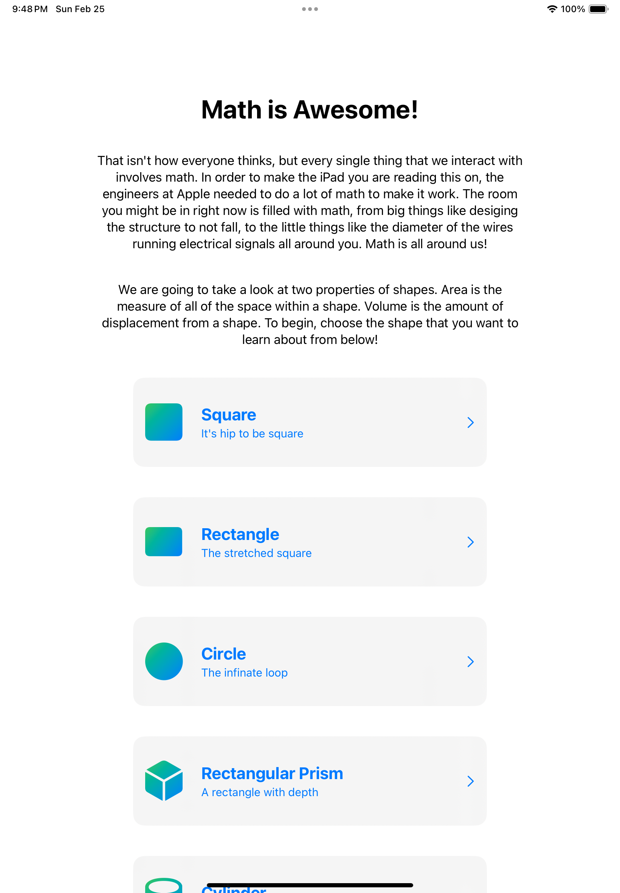

# Math Is Awesome

An iOS app that can be used to illustrate concepts of area and volume in an interactive way.

_This project was completed for the [Swift Student Challenge 2024](https://developer.apple.com/swift-student-challenge). If you use parts of this project for your own challenge, remember to check the terms regarding what you may use._

## Summary

This project was made for the Swift Student Challenge 2024. It was inspired by my own difficulty in understanding complex 3 dimensional problems in integral calculus. I wanted to create a way to visualize what was going on as the inputs were changed.

I have a limited knowledge with working in three dimensional objects in Swift and knew that targeting calculus would be too much for the limited time that this challenge was open for. As a result, I created a project that targeted introductory geometry. The app allows the user to check the area of 2D shapes, and volume of 3D shapes.

## Take Aways

This app project was a learning experience. I have limited experience working with Swift, SwiftUI, SceneKit, and 3D objects. It was a good opportunity to build and refine my skills. In making the project again I would make some revisions including cleaner code, more time spent on design, and adjusting the camera angle to make it clear that the volumetric shapes are three-dimensional.

## Screenshots

